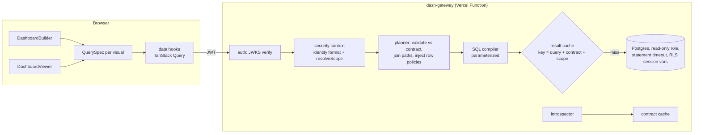

# Dashboard builder — embeddable live dashboards on your own data

> Status: draft v1 · Owner: Georges · Updated: 2026-10-04 · Domain: Data · CV highlight: yes · Language: TypeScript · Hosting: Vercel (mode B) + Supabase

## 1. Summary

A library that a developer embeds in their app so the app's **end users** build live dashboards on their own data without writing code, in the spirit of Power BI. It has two halves:

- **`dash-gateway`** (server): connects to the host app's database with a read-only credential, inspects the authorized tables, generates a **data contract**, enforces each user's access rules, compiles dashboard queries to SQL, and caches results.
- **`dash-react`** (browser): a builder where a user picks a visualization, drops fields and measures into its slots, filters and arranges visuals, plus a viewer that renders saved dashboards with cross-filtering and live refresh.

The demo is "Acme Shop", a fake multi-tenant SaaS whose visitors sign in anonymously and build dashboards on a continuously growing orders database.

## 2. Goals and non-goals

**Goals**
- Contract inferred from the source schema, never hand-written; dashboards survive schema changes by detecting broken fields.
- Security by construction: the browser never sees credentials; every query is scoped to the caller's security context; the cache can never leak rows across scopes.
- A formula language for measures that non-developers can use (DAX-like, simpler), with autocomplete and precise error messages.
- Live dashboards: visuals refresh on an interval with cache-aware polling.
- Pluggable visuals: a new chart type is a plugin, with no change to the core.

**Non-goals (v1)**
- Writing to the source database.
- Sources other than Postgres (REST connector is v1.1).
- Arbitrary SQL from end users.
- Pixel-perfect report printing.

## 3. Users and demo story

- **Host developer:** installs the packages, writes `dash.config.ts`, mounts the gateway route, renders `<DashboardBuilder>`.
- **End user:** a non-technical user of the host app.

**Demo script (60 seconds):** visit the demo → anonymous sign-in assigns two tenants → open the builder → pick "Bar", drop `Product category` on the axis and the measure `Revenue` on the values → add a line chart of `Orders` by day → click a bar to cross-filter the line → watch new orders arrive every minute → open the "Under the hood" drawer: security context, generated SQL, cache hit/miss, query time.

## 4. Scope

**v1 (must):** Postgres source; contract inference and versioning; JWT auth with JWKS; identity format validation; table allowlist; row policies; query compilation with join-path resolution; formula language; result cache scoped by security context; React builder (visual picker, field wells, filters, grid layout, measure editor); viewer with cross-filtering and interval refresh; visuals KPI, bar, line, table; dashboards saved per user; demo app with live data.

**v1.1 (should):** REST/JSON connector with in-browser finishing through DuckDB-WASM; CSV upload; Arrow IPC results; guided remapping of broken fields; time intelligence (`PREVIOUSPERIOD`, running totals); `CALCULATE`-style filter-context changes; scatter and map visuals; Redis cache adapter; server-sent events for push refresh.

**Later:** multi-source joins, row-level export, sharing dashboards between users.

## 5. Architecture



**Repository layout (pnpm + Turborepo)**
```
dashboard-builder/
├── packages/
│   ├── core/       # types, contract schema, DashboardSpec schema, formula language, QuerySpec
│   ├── gateway/    # server: config, sources/postgres, introspection, auth, planner, compiler, cache, handlers
│   ├── react/      # provider, builder, viewer, cross-filter coordinator, hooks
│   └── visuals/    # registry + KPI, bar, line, table plugins
├── apps/
│   └── demo/       # Next.js app: Acme Shop, gateway route, Supabase auth, dashboard storage
├── db/             # migrations (dash, dash_demo), seed, pg_cron job
└── docs/           # DESIGN.md, ENGINEERING.md, AGENT_LOG.md, adr/
```
`core` has no runtime dependencies besides zod; `react` never imports `gateway`.

## 6. Core algorithms and design decisions

**Hand-written core:** contract inference, join-path resolution, policy injection, formula language (lexer, Pratt parser, type checker, SQL compiler), cache keying, cross-filter coordinator, field-well logic. Libraries allowed around it: `postgres` (postgres.js) driver, `jose` (JWT/JWKS), zod, React, dnd-kit (drag and drop), react-grid-layout, CodeMirror 6 (formula editor), Apache ECharts (chart drawing only), TanStack Query.

**Contract inference.** Read `information_schema` and `pg_catalog` for the allowlisted tables: columns, types, nullability, primary keys, foreign keys, and `pg_stats` estimates (row counts, distinct values). Assign each column a role:
- `id`: primary keys, foreign keys, names ending in `_id`.
- `time`: `date`, `timestamp`, `timestamptz`.
- `measure` candidate: numeric, not a key; default aggregation `SUM`, or `AVG` when the name matches `price|rate|ratio|pct|percent|score`.
- `dimension`: everything else; flagged `highCardinality` above 10,000 distinct values (excluded from axis slots by default).

Foreign keys become many-to-one relationships. The contract carries `schemaHash` (SHA-256 of the normalized schema plus config), which is its version.

**Join-path resolution.** Tables form a graph with many-to-one edges. For a query, the base table is the table of the measures (all measures must share one fact table in v1). Every dimension's table must be reachable from the base by following many-to-one edges; the shortest such path is used. Ambiguous paths (two shortest paths) and fan-out (a path through a one-to-many edge) are rejected with an explanation naming the tables. Chasm-trap handling through pre-aggregation is v1.1.

**Formula language.** Grammar: numbers, strings, field references `table.column`, measure references `[Name]`, arithmetic, comparisons, `AND/OR/NOT`, functions `SUM, AVG, MIN, MAX, COUNT, COUNTDISTINCT, DIVIDE, IF, COALESCE, ROUND, DATE_TRUNC`. The type checker tracks type (number, string, boolean, date) and level (row or aggregate): aggregates take row-level arguments; a measure's top level must be aggregate; mixing levels is an error with a source span. `DIVIDE(a, b)` compiles to a null-safe division. Output: a SQL expression AST, rendered by the Postgres dialect (DuckDB dialect in v1.1).

**Security model.**
- Configuration declares the identity claim and its **format** (`uuid`, `int`, or a regex); values that do not match are rejected before any query.
- `resolveScope(claims)` (a host-provided function) returns the security context, for example `{ userId, tenantIds }`. The demo looks up `dash.memberships`.
- Row policies bind columns to scope attributes, for example `dash_demo.orders.tenant_id IN scope.tenantIds`. The planner injects them as mandatory predicates on every table in the join path that has a policy.
- Defense in depth: queries run in a transaction that sets `set_config('app.tenant_ids', …, true)` and `SET LOCAL statement_timeout`; the demo's Postgres RLS policies read that setting, so a planner bug still cannot leak rows.
- Identifiers come only from the contract (quoted); values are always bound parameters. Limits: 10,000 rows returned, 2 s statement timeout, 20 queries per request batch.

**Caching.** Contract cache keyed by source and config, refreshed when the schema hash changes (checked at most every 60 s). Result cache keyed by `sha256(normalized QuerySpec + contract version + scope hash)`, TTL = the smallest refresh interval among requesting visuals (minimum 5 s), LRU bounded by bytes. The client sends `If-None-Match`; unchanged results return `304`. Missing the scope in the key is a release-blocking bug and has its own property test.

**Cross-filtering.** A selection in one visual becomes a filter clause on its field; the coordinator adds it to every other visual's QuerySpec on the page, while the source visual only highlights. Clearing the selection removes it.

## 7. Interfaces

**Host configuration (`dash.config.ts`, secrets from environment variables)**
```ts
export default defineGateway({
  source: postgresSource({ url: process.env.DASH_SOURCE_URL! }),
  auth: jwtAuth({ jwksUrl: process.env.DASH_JWKS_URL!, issuer: process.env.DASH_JWT_ISSUER!, audience: "authenticated" }),
  identity: { claim: "sub", format: "uuid" },
  tables: ["dash_demo.orders", "dash_demo.order_items", "dash_demo.products", "dash_demo.customers"],
  resolveScope: async (claims, db) => ({ userId: claims.sub, tenantIds: await tenantsOf(db, claims.sub) }),
  policies: [{ table: "dash_demo.orders", column: "tenant_id", in: "tenantIds" }],
  cache: memoryCache({ maxBytes: 50_000_000 }),
});
```

**Gateway HTTP API** (mounted at `/api/dash` through a Next.js route handler adapter; Node runtime)

| Method and path | Body / response |
| --- | --- |
| `GET /contract` | DataContract; `ETag` = schema hash |
| `POST /query` | `{ queries: QuerySpec[] }` → `{ results: [{ columns, data (column-major), meta: { cache, ms } }] }` |
| `GET /health` | `{ status: "ok", db: "ok" }` after `select 1` |

**QuerySpec:** `{ dimensions: [{ field, timeGrain? }], measures: [{ name } | { formula }], filters: [{ field, op, values }], sort?, limit? }`.

**DashboardSpec (stored JSON, versioned):** `{ specVersion: 1, contractVersion, title, refreshIntervalSec, measures: [{ name, formula, format }], filters: [...], layout: [{ i, x, y, w, h }], visuals: [{ id, type, slots: { category: [...], value: [...] }, options }] }`.

**React API:** `<DashProvider gateway="/api/dash" getToken={…}>`, `<DashboardBuilder spec onChange onSave />`, `<DashboardViewer spec />`, `useContract()`, `registerVisual(plugin)`.

**Visual plugin contract:** `{ type, label, icon, slots: [{ name, accepts: "dimension" | "measure" | "time", min, max }], toQuery(slots, options) => QuerySpec, render(result, options, events) }`. The builder only offers fields a slot accepts.

**Visual identity:** a calm analytical look: warm off-white canvas, ink-dark text, one saturated accent for selections, monospace numerals in KPI cards, dense but generous spacing. Dark mode supported.

## 8. Data model and storage

Shared Supabase project `portfolio` (Paris, `eu-west-3`; ENGINEERING.md §11), schemas `dash` (app data, role `dash_app`) and `dash_demo` (source data, read-only role `dash_reader`). Sign-in uses the project's anonymous sign-ins, which other apps share, so access to dashboards and tenants is decided by `dash.dashboards.owner_id` and `dash.memberships`, never by being signed in.

| Table | Columns (main) | Notes |
| --- | --- | --- |
| `dash.dashboards` | `id uuid`, `owner_id uuid`, `title`, `spec jsonb`, `contract_version`, `created_at`, `updated_at` | RLS: owner only |
| `dash.memberships` | `user_id uuid`, `tenant_id int` | Two demo tenants assigned at first sign-in |
| `dash_demo.tenants` | `id`, `name`, `region` | 5 tenants |
| `dash_demo.customers` | `id`, `tenant_id`, `name`, `country`, `segment`, `created_at` | |
| `dash_demo.products` | `id`, `tenant_id`, `name`, `category`, `unit_price` | |
| `dash_demo.orders` | `id`, `tenant_id`, `customer_id`, `ordered_at`, `status`, `channel` | Indexed on `(tenant_id, ordered_at)` |
| `dash_demo.order_items` | `id`, `order_id`, `tenant_id`, `product_id`, `quantity`, `unit_price` | |

`dash_demo` tables carry RLS policies on `tenant_id = ANY(string_to_array(current_setting('app.tenant_ids', true), ',')::int[])`. A `pg_cron` job inserts a few orders per tenant every minute and deletes generated orders older than 90 days, keeping the schema under 50 MB. Migrations use Drizzle Kit with the history table in `dash`.

## 9. Development plan

| Milestone | Stack of PRs | Acceptance criteria |
| --- | --- | --- |
| M0 Scaffold | monorepo tooling; CI; demo app shell with Supabase anonymous auth; `/api/dash/health`; migrations + seed; pr-meme caller | Preview and production deploy; health returns ok |
| M1 Contract | introspection; role inference; relationships; schema hash; `GET /contract` | Golden contracts for three fixture schemas |
| M2 Query engine | QuerySpec validation; join paths; policy injection; SQL compiler; execution with limits; `POST /query` | Integration tests against Postgres; leakage property test passes |
| M3 Formulas | lexer and Pratt parser; type checker with spans; compiler; measures in contract and specs | Error messages point at the right span; golden SQL |
| M4 Viewer | visual registry; KPI, bar, line, table; viewer from a spec; loading/empty/error states | Saved fixture specs render identically (visual tests) |
| M5 Builder | visual picker; field wells with drag and drop; filters; grid layout; formula editor with autocomplete; save/load | E2E: build and save the demo dashboard |
| M6 Live and fast | cross-filter coordinator; interval refresh with ETag; result and contract caches; "Under the hood" drawer | Cached query p95 < 150 ms; cross-filter E2E passes |
| M7 Ship | demo polish and onboarding; README, GIF, architecture diagram; npm release via Changesets | Definition of done (§15) |

## 10. Testing strategy

- **Unit:** role inference on fixture columns; join-path search (shortest, ambiguous, fan-out rejection); policy injection; formula lexer, parser and type checker (table-driven, including error spans); SQL rendering (snapshots); cache-key normalization (field order does not change the key; scope does).
- **Property (fast-check):**
  - Equivalence: random QuerySpecs over the fixture contract return the same numbers from Postgres as a reference implementation that aggregates the fixture rows in TypeScript.
  - Isolation: for random scopes and queries, no returned row belongs to a tenant outside the scope, including when served from cache.
  - Parser round trip: pretty-printing a parsed formula and parsing it again yields the same AST.
- **Integration:** gateway against a Postgres service container with the demo schema, RLS policies and seed; JWT verification against a test JWKS (valid, expired, wrong audience, malformed identity format).
- **Component:** builder interactions with React Testing Library (dropping a field into a slot updates the spec; invalid fields are not droppable).
- **End-to-end (Playwright, local production build + local Supabase stack via `supabase start`, needed for anonymous sign-in):** build a dashboard, save, reload, cross-filter, see a refreshed value after inserting rows.
- **Visual:** screenshots of each visual with fixed data.
- **Performance:** a script reports gateway latency (cached and uncached) for the demo dashboard.

Coverage: `core` and `gateway` at least 90% of lines.

## 11. CI/CD

| Workflow | Jobs |
| --- | --- |
| `ci.yml` | `lint`, `typecheck`, `test` (unit + property), `integration` (Postgres service), `build`, `e2e` |
| `deploy.yml` (mode B) | `migrate` (main only) → `deploy` (preview on PRs, production on main) → `smoke` |
| `release.yml` | Changesets version PR and npm publish with provenance for `@adam-riffi/dash-*` |
| `nightly.yml` | property tests with 10× runs, `pnpm audit`, CodeQL |
| `pr-meme.yml` | standard caller |

Required checks: `lint`, `typecheck`, `test`, `integration`, `build`, `e2e`.

## 12. Deployment and configuration

Vercel project rooted at `apps/demo` (Next.js, Node runtime for gateway routes), mode B. Functions run in Paris (`cdg1`), next to the database.

| Variable | Where | Purpose |
| --- | --- | --- |
| `DASH_SOURCE_URL` | Vercel (server) | Transaction-pooler URL for role `dash_reader` |
| `DASH_APP_DATABASE_URL` | Vercel (server) | Transaction-pooler URL for role `dash_app` |
| `DASH_JWKS_URL`, `DASH_JWT_ISSUER` | Vercel (server) | Supabase Auth JWKS endpoint and issuer |
| `NEXT_PUBLIC_SUPABASE_URL`, `NEXT_PUBLIC_SUPABASE_PUBLISHABLE_KEY` | Vercel (client) | Supabase Auth in the browser |
| `DATABASE_URL_MIGRATIONS` | GitHub secret | Migrations and pg_cron job setup |
| `VERCEL_TOKEN`, `VERCEL_ORG_ID`, `VERCEL_PROJECT_ID` | GitHub secrets | Prebuilt deploys |

**One-time setup:** run the dashboard section of `bootstrap.sql`; check that anonymous sign-ins are on in the shared project's Auth settings and add the demo's production and preview domains to its redirect allowlist (settings owned by `portfolio-infra`); confirm the JWKS URL; add the demo to uptime targets.

**Smoke checks:** `/api/dash/health` returns ok; the demo page loads and the seeded sample dashboard shows non-zero revenue.

## 13. Performance, security and observability

- Budgets: cached query p95 < 150 ms, uncached p95 < 800 ms on demo data; builder interactions < 100 ms; ECharts loaded lazily.
- Security: §6 security model; rate limit of 60 queries per minute per user in the gateway; the "Under the hood" drawer shows SQL only in development or for the demo's own dataset.
- Observability: each query logs `requestId`, scope hash (never raw tenant IDs), cache status, rows and duration.

## 14. Risks and open questions

- Scope creep in the builder: v1 limits visuals to four and filters to equality, ranges and lists.
- Formula language design can sprawl: v1 grammar is fixed in §6; additions need an ADR.
- Supabase anonymous users accumulate: a weekly job deletes anonymous users inactive for 30 days and their dashboards.
## 15. Definition of done

- [ ] Demo script in §3 works on the production URL.
- [ ] Isolation and equivalence property tests in CI.
- [ ] Packages published to npm with a README showing host setup in under 20 lines.
- [ ] Repository README per ENGINEERING.md §15, including the security model diagram and latency numbers.
- [ ] CV line updated with one measured result (for example cached latency or number of property-test cases).
